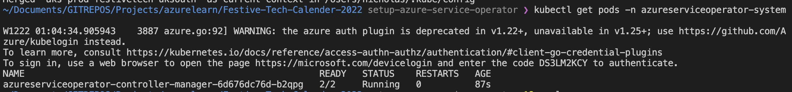
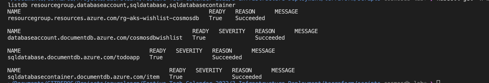

# Integrate to CosmosDB #

In this section, we will integrate CosmosDB to use it as a database for the application. We will look at how to create the CosmosDB instance and the database in Azure from the aks cluster. 

When connecting the CosmosDB to the application, we need to use Azure Service Operator (ASO) to create the CosmosDB instance and the database. We will also need to create a secret to store the connection string of the CosmosDB. It is also possible to integrate it directly into the application.

- Install Azure Service Operator by following the instructions here. [Install Azure Service Operator](https://github.com/Azure/azure-service-operator/tree/main/v2#installation) This will install the Azure Service Operator in the cluster using the Helm chart.

Note: When creating the service principal for AsO, make sure to give the service principal the contributor role on the subscription. It is required for the Azure Service Operator to create the resources in the subscription. You will need the following for the service principal:

* AppID 
* Client Secret 
* Tenant ID 
* Subscription ID 

- Add the above values to the prod key vault in Azure Portal. 

- Go to Azure DevOps and add the below values to the variable group created:

 * AZURE_SERVICE_OPERATOR_CLIENT_ID 
 * AZURE_SERVICE_OPERATOR_CLIENT_SECRET 
 * AZURE_SERVICE_OPERATOR_TENANT_ID 
 * AZURE_SERVICE_OPERATOR_SUBSCRIPTION_ID

- Run kubectl get pods -n azureserviceoperator-system to check if the pods are running.

Run kubectl get -n wishlistdb resourcegroup,databaseaccount,sqldatabase,sqldatabasecontainer to see all the resources created by the Azure Service Operator. Please wait for a few minutes until it is all completed. 

References: 

- https://github.com/Azure/azure-service-operator 

- https://github.com/Azure-Samples/cosmos-aks-samples/tree/main/ASO
