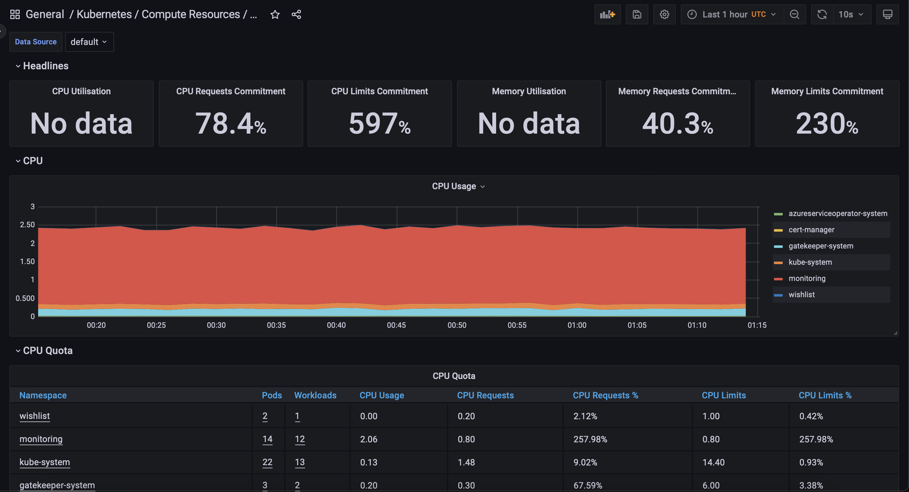
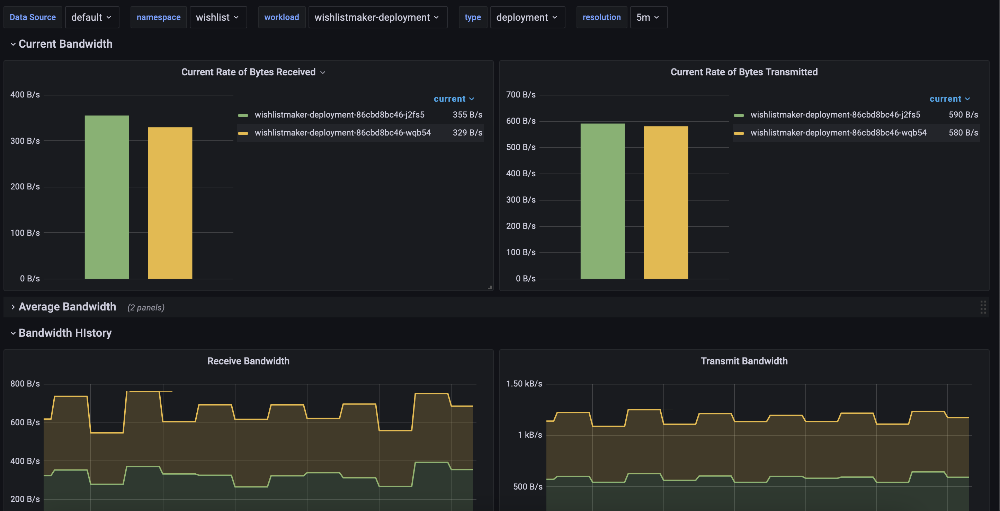

# Montioring Prometheus and Grafana #

Another way to monitor your application is to use Grafana and Prometheus. 

Protheus is an open-source monitoring system and time series database. Grafana is an open-source analytics and monitoring solution. Together, they provide a powerful monitoring solution for your application. For this lab, both services will install via helm charts into the AKS cluster. However, it might be possible to install just Prometheus and Managed Azure Grafana for it. 

## Set up Grafana and Prometheus ##

This lab will look into setting up Grafana and Prometheus to monitor applications.

1. Install Prometheus and Grafana using Helm charts

2. Configure Grafana to use Prometheus as a data source

3. Create a dashboard in Grafana to monitor the application

### Install Prometheus and Grafana using Helm charts ###

1. Install Prometheus and Grafana using Helm charts

 ```bash
 helm repo add prometheus-community https://prometheus-community.github.io/helm-charts
 helm repo update
 helm install prometheus prometheus-community/prometheus
 helm install grafana prometheus-community/grafana
 ```
Run the montioring pipeline [montioring](./pipelines/cd-montioring.yml) to install the helm charts for prometheus and grafana. Once installed, go back to your cluster in the Azure portal and click on service blade. Find the load balancer IP address for the Grafana service. Copy the IP address and paste it into a browser. It will prompt enter a username and password. 

The default username is admin, and the password is prom-operator. 

### View the Grafana dashboard to monitor the Kubernetes cluster ###

Head into the dashboard blade in Grafana to add a new dashboard. It will display a list of available dashboards to monitor the Kubernetes cluster. 

Below are some of the dashboards for monitoring the cluster.

Cluster CPU and Memory Usage: This dashboard shows the CPU utilization of the cluster and memory usage. The CPU usage displays the percentage of the total CPU available. Below shows the CPU consumption is getting relatively high.



We can also monitor the network traffic of the cluster. The network traffic displays the total network traffic available in the AKS cluster.




References: 

- https://docs.microsoft.com/en-us/azure/aks/tutorial-kubernetes-monitor

- https://dev.to/thenjdevopsguy/monitoring-and-observability-in-azure-kubernetes-service-with-prometheus-4jbi

